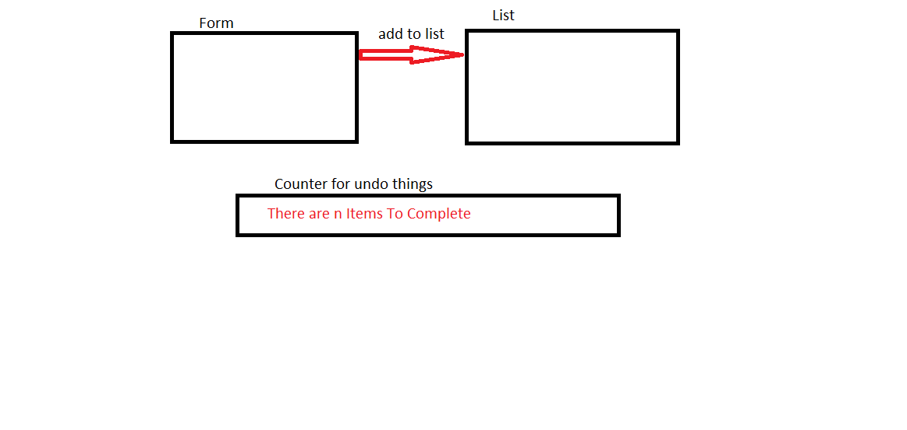

# Todo List

## LAB - Class 31

## Project: Todo

## Author: Obada Tumah

## Links and Resources

[PR](#)

### PORT - 3000

### How to initialize/run your application (where applicable):

### npm start to start the code.

### npm test to test the code.

### npm run deploy to publish your project

### Tests

### i used react test renderer and enzyme to test three cases.

